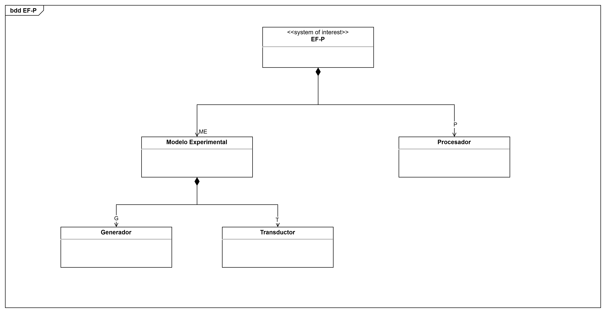
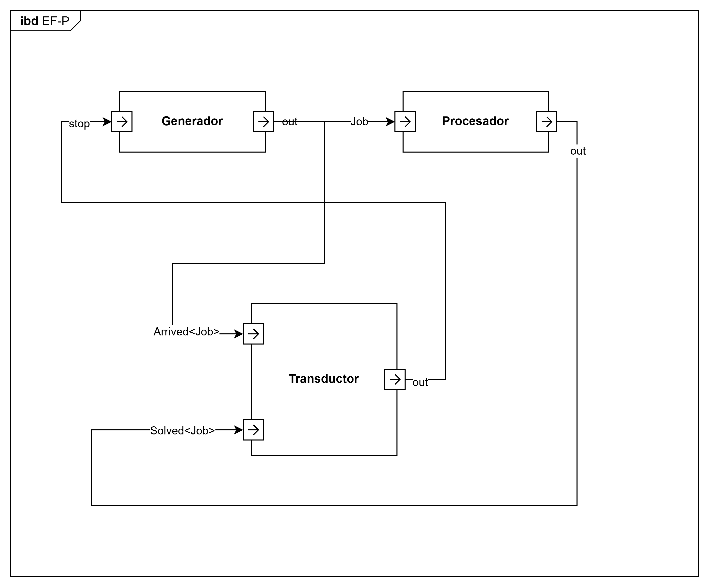

# 🧩 Prueba inicial de DEVS en Rust
Este proyecto es una **implementación experimental inicial** del formalismo **DEVS (Discrete Event System Specification)**, utilizando la librería `xdevs`.

El objetivo principal no es un sistema final, sino una **prueba de concepto** para validar la construcción de modelos DEVS acoplados y su simulación en Rust.

El sistema modela un flujo de trabajos donde:

* Un **Generator** crea trabajos periódicamente.
* Un **Processor** procesa esos trabajos.
* Un **Transducer** recoge estadísticas y detiene la simulación.

## 🛠️ Tecnologías
* Rust.
* Cargo. (Gestión de dependencias y build)
* xdevs. (simulación DEVS)


## ⚙️ Arquitectura del sistema
El modelo está compuesto por:

### 🔹 Generator
* Genera trabajos cada cierto intervalo de tiempo. (`g_time`)
* Puede ser detenido por el `Transducer`.

### 🔹 Processor
* Recibe trabajos del `Generator`.
* Los procesa durante un tiempo fijo. (`p_time`)
* Envía los trabajos procesados al `Transducer`.

### 🔹 Transducer
* Recoge:
  * Trabajos generados.
  * Trabajos procesados.
* Tras un tiempo (`t_time`), detiene la simulación



## 🔁 Flujo de datos


## 🚀 Ejecución
### 1. Clonar el repositorio
```bash
git clone https://github.com/iscar-ucm/2025-tfm-miguel.git
cd 2025-tfm-miguel/GPT
```

### 2. Ejecutar el proyecto
```bash
cargo run
```

## 🧪 Parámetros de simulación
En `main.rs`:

```rust
let efp = efp(1.0, 3.0, 100.0);
```

* `1.0` → tiempo entre generación de trabajos.
* `3.0` → tiempo de procesamiento.
* `100.0` → tiempo hasta detener la simulación.

## 📊 Salida esperada
Durante la ejecución verás logs como:

```
Generator: Job Generated - 0
Generator: Job Generated - 1
Generator: Job Generated - 2
Generator: Job Generated - 3
Processor: Job Processed - 0
...
Stopped!
Processor: Job Processed - 99
```

## 📁 Estructura del proyecto
```
docs/
 ├── bdd.png   # Arquitectura general del sistema
 ├── ibd.png   # Conexiones internas del sistema
 └── stm.png   # Máquina de estados
src/
 └── main.rs   # Implementación completa del modelo
```

## 📌 Referencias
* [Lenguaje de programación Rust](https://doc.rust-lang.org/book/).
* [xDevs](https://crates.io/crates/xdevs).