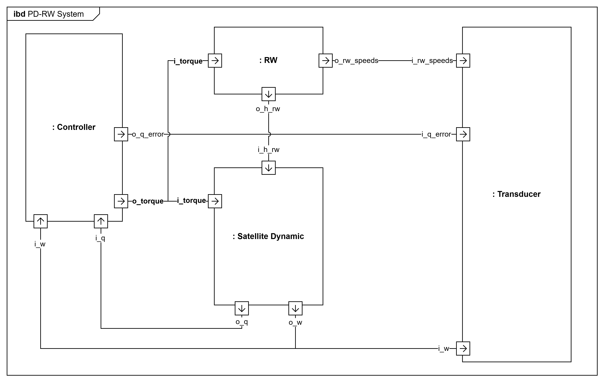

# 🛰️ Simulación ADCS en Rust `no-std` (basada en DEVS)
Este proyecto implementa una **simulación de un sistema de Control de Actitud para nanosatélites (ADCS)** utilizando el formalismo **DEVS (Discrete Event System Specification)** en Rust `no-std`.

El sistema modela una arquitectura completa de control espacial con dinámica, control, actuadores y análisis de datos.

## 🔁 Migración de `xdevs` (std → no-std)
Esta sección describe la transición del modelo DEVS desde una implementación basada en **`std`** hacia una arquitectura **`no_std`**, con el objetivo de mejorar la modularidad, escalabilidad y compatibilidad con sistemas embebidos.

### 🧱 Modelo en `std` (modelo clásico)
En la versión std, el modelo DEVS se define como una estructura única que contiene:
* Puertos de entrada y salida.
* Estado interno.
* Parámetros del sistema.

Ejemplo simplificado:

```rust
pub struct Controller {
    component: Component,
    i_w: InPort<Vec3>,
    i_q: InPort<Quaternion>,
    o_torque: OutPort<Vec3>,
    o_qerror: OutPort<Quaternion>,
    w: Option<Vec3>,
    q: Option<Quaternion>,
    torque: Option<Vec3>,
    q_error: Option<Quaternion>,
    sigma: f64,
}
```

### 🌱 Modelo en `no-std` (arquitectura desacoplada)
En la versión `no_std`, el diseño cambia radicalmente:

* El estado se separa en una estructura independiente.
* Los puertos se declaran mediante `component!`.
* El modelo se define como un sistema declarativo.

#### 🧩 Estado del sistema
```rust
pub struct ControllerState {
    w: Option<Vec3>,
    q: Option<Quaternion>,
    torque: Option<Vec3>,
    q_error: Option<Quaternion>,
    sigma: f64,
    time: f64,
    q_target: Quaternion,
    kp: f64,
    kd: f64,
    max_torque_rw: f64,
}
```
#### 🧩 Definición del componente
```rust
component!{
    ident = Controller,
    input = {
        i_w<Vec3>,
        i_q<Quaternion>
    },
    output = {
        o_torque<Vec3>,
        o_qerror<Quaternion>,
    },
    state = ControllerState
}
```

## 🚀 Objetivo del proyecto
Simular el comportamiento de un sistema ADCS realista compuesto por:

* Controlador de actitud (PD con cuaterniones).
* Ruedas de reacción (actuadores).
* Dinámica del satélite (cuerpo rígido).
* Transductor de telemetría (logging y análisis).
* Visualización de resultados.

## 🛠️ Tecnologías
* Rust no-std.
* Cargo. (Gestión de dependencias y build)
* xdevs-no-std. (Simulación DEVS no-std)
* plotters. (Representaciones gráficas)
* nalgebra. (Matemáticas)

## 🧩 Arquitectura del sistema
El sistema está compuesto por los siguientes módulos:

### 🧠 Controlador
* Control PD basado en cuaterniones.
* Genera torque de corrección.
* Calcula error de actitud.

### ⚙️ Reaction Wheels (RW)
* Convierte torque en velocidad angular.
* Modela dinámica rotacional de actuadores.
* Aplica saturación física.

### 🛰️ Satellite Dynamics
* Modelo de cuerpo rígido 3D.
* Dinámica rotacional completa.
* Cinemática de cuaterniones.

### 📊 Transducer
* Registro de telemetría.
* Historial de variables físicas.
* Cálculo de rangos estadísticos.

### 📈 Plotter
* Visualización de resultados.
* Gráficas de:
  * error de actitud.
  * velocidad angular.
  * velocidad de ruedas.


## 🔁 Flujo de datos


## 🚀 Ejecución
### 1. Clonar el repositorio
```bash
git clone https://github.com/iscar-ucm/2025-tfm-miguel.git
cd 2025-tfm-miguel/PD-RW-no-std
```

### 2. Ejecutar el proyecto
```bash
cargo run
```
## 📌 Parámetros principales

En `main.rs`:
```rust
let total_time = 100.0; // duración simulación
/// Paso temporal.
let h = 0.01;
/// Cuaternión de referencia.
let q_target = Quaternion::default();

/// Control proporcional.
let kp = 0.01;
/// Control derivativo.
let kd = 0.1;
/// Torque máximo de las ruedas.
let max_torque_rw = 0.001;

/// Velocidad inicial de las ruedas de reacción.
let rw_speeds_initial = Vec3(Vector3::new(0.0, 0.0, 0.0));
/// Inercia de las ruedas de reacción.
let i_rw = Matrix3::from_diagonal(&Vector3::new(5.0e-5, 5.0e-5, 5.0e-5));
/// Velocidad máxima angular de las ruedas de reacción.
let max_speed_rw = 20.0;
/// Velocidad angular inicial.
let w0 = Vec3(Vector3::new(0.1, -0.1, 0.2));
/// Rotación inicial de 45º en el eje (1, 1, 1)
let angle_initial = std::f64::consts::FRAC_PI_4;
let axis_initial = Vector3::new(1.0, 1.0, 1.0).normalize();
let w = (angle_initial / 2.0).cos();
let v = axis_initial * (angle_initial / 2.0).sin();
/// Cuaternión actual.
let q0 = Quaternion(nalgebra::Quaternion::new(w, v.x, v.y, v.z));

```
## 📊 Resultados
Se genera automáticamente una imagen: `images/Simulation Result.png`

Incluye:
* Error de actitud (cuaternión).
* Velocidad angular del satélite.
* Velocidad de ruedas de reacción.

Se observa cómo el error de actitud converge a cero, la velocidad angular se amortigua y las ruedas se estabilizan, indicando que el controlador PD logra llevar el satélite a la orientación deseada de forma estable.


## 📁 Estructura del proyecto
```
src/
├── main.rs                     # Punto de entrada de la simulación ADCS
├── plotters.rs                 # Generación de gráficas de resultados
├── controller.rs               # Controlador PD de actitud
├── rw.rs                       # Dinámica de ruedas de reacción
├── satellite_dynamics.rs       # Dinámica del satélite rígido
├── transducer.rs               # Registro de telemetría del sistema
├── types.rs                    # Tipos matemáticos (Vec3, Quaternion)
│
docs/
├── bdd.png                     # Arquitectura general del sistema (BDD)
├── ibd.png                     # Conexiones internas del sistema (IBD)
├── stm.png                     # Máquina de estados del controlador (STM)
│
images/
└── Simulation Result.png       # Resultados gráficos de la simulación
```

## 📌 Referencias
* [Rust no-std](https://docs.rust-embedded.org/book/intro/no-std.html).
* [xdevs-no-std](https://crates.io/crates/xdevs-no-std).
* [Plotters](https://docs.rs/plotters/latest/plotters/).
* [nalgebra](https://docs.rs/nalgebra/latest/nalgebra/).
* [libm](https://crates.io/crates/libm).
