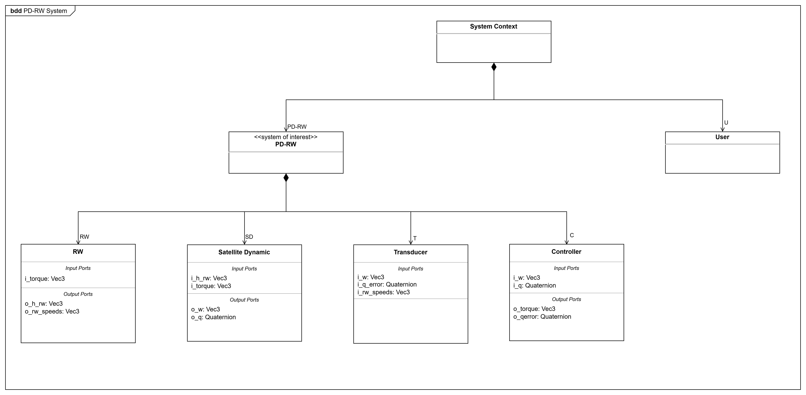

# 🛰️ Simulación ADCS en Rust (basada en DEVS)
Este proyecto implementa una **simulación de un sistema de Control de Actitud para nanosatélites (ADCS)** utilizando el formalismo **DEVS (Discrete Event System Specification)** en Rust.

El sistema modela una arquitectura completa de control espacial con dinámica, control, actuadores y análisis de datos.

## 🚀 Objetivo del proyecto
Simular el comportamiento de un sistema ADCS realista compuesto por:

* Controlador de actitud (PD con cuaterniones).
* Ruedas de reacción (actuadores).
* Dinámica del satélite (cuerpo rígido).
* Transductor de telemetría (logging y análisis).
* Visualización de resultados.

## 🛠️ Tecnologías
* Rust.
* Cargo. (Gestión de dependencias y build)
* xdevs. (Simulación DEVS)
* plotters. (Representaciones gráficas)
* nalgebra. (Matemáticas)

## 📚 Conceptos Teóricos
El sistema ADCS (*Attitude Determination and Control System*) es responsable de controlar la orientación de un satélite en el espacio.

En esta simulación se implementa un esquema clásico de control de actitud utilizando cuaterniones, dinámica rotacional y ruedas de reacción.

---
### 🧭 Representación de actitud mediante cuaterniones
La orientación del satélite se representa mediante **cuaterniones**, evitando problemas asociados a los ángulos de Euler como el *gimbal lock*.

Un cuaternión se define como:
```math
q = \left[ q_w, q_x, q_y, q_z \right]
```

donde:
- $q_w$ es la parte escalar.
- $(q_x,q_y,q_z)$ representan la parte vectorial.

La evolución temporal del cuaternión viene dada por:
```math
\dot{q} = \frac{1}{2}\Omega(\omega)q
```

donde:
- $\dot{q}$ es la velocidad de cambio de actitud.
- $q$ es el cuaternión de actitud.
- $\Omega(\omega)$ es la matriz cinemática asociada.

```math
\Omega(\omega)=
\begin{bmatrix}
0 & -\omega_x & -\omega_y & -\omega_z \\
\omega_x & 0 & \omega_z & -\omega_y \\
\omega_y & -\omega_z & 0 & \omega_x \\
\omega_z & \omega_y & -\omega_x & 0
\end{bmatrix}
```

---
#### ⚙️ Dinámica rotacional del satélite
El satélite se modela como un cuerpo rígido tridimensional utilizando las ecuaciones de Euler:
```math
I_{sat}\dot{\omega} + \omega \times (I_{sat}\omega + h_{rw}) = T_c + T_d
```

donde:
* $I_{sat}$ es la matriz de inercia del satélite.
* $\omega$ es la velocidad angular del satélite.
* $h_{rw}$ es el momento angular de las ruedas de reacción.
* $T_c$ es el torque de control generado por las ruedas.
* $T_d$ es el torque de perturbaciones externas (en este modelo se asume $T_d = 0$).

Este modelo permite simular el comportamiento dinámico realista del nanosatélite.

---
#### 🌀 Interpretación del término giroscópico
```math
\omega \times (I_{sat}\omega + h_{rw})
```

Este término representa el **efecto giroscópico**, que aparece porque el sistema de referencia (el satélite) está en rotación.
* $I_{sat}\omega + h_{rw}$ es el momento angular total del sistema.
* El producto cruzado representa cómo cambia su dirección en el marco rotante.

---
#### 🔁 Ecuación de aceleración angular
Reordenando la ecuación de Euler:

```math
\dot{\omega} = I_{sat}^{-1}\left(T_c - \omega \times (I_{sat}\omega + h_{rw})\right)
```

Esta ecuación define cómo evoluciona la velocidad angular del satélite en función del torque aplicado y los efectos giroscópicos.

---
### 🧠 Control PD de actitud
El controlador implementado es un regulador proporcional-derivativo (PD), ampliamente utilizado en sistemas espaciales debido a su simplicidad y estabilidad.

La ley de control utilizada es:

```math
\tau = -K_p q_e - K_d \omega
```

donde:
* $q_e$ es el error de actitud.
* $K_p$ es la ganancia proporcional.
* $K_d$ es la ganancia derivativa.
* $\omega$ es la velocidad angular actual.

El objetivo del controlador es minimizar el error de orientación y amortiguar las velocidades angulares.

---
### ⚙️ Ruedas de reacción (Reaction Wheels)
Las ruedas de reacción son actuadores internos que generan torque mediante conservación del momento angular.

El momento angular de las ruedas se calcula a partir de:

```math
h_{rw} = I_{rw} v_{rw}
```

donde:
* $I_{rw}$ es la inercia de la rueda.
* $v_{rw}$ es la velocidad de las ruedas.


## 🧩 Arquitectura del sistema
El sistema está compuesto por los siguientes módulos:

### 🧠 Controlador
* Control PD basado en cuaterniones.
* Genera torque de corrección.
* Calcula error de actitud.

### ⚙️ Reaction Wheels (RW)
* Convierte torque en velocidad angular.
* Modela dinámica rotacional de actuadores.
* Aplica saturación física.

### 🛰️ Satellite Dynamics
* Modelo de cuerpo rígido 3D.
* Dinámica rotacional completa.
* Cinemática de cuaterniones.

### 📊 Transducer
* Registro de telemetría.
* Historial de variables físicas.
* Cálculo de rangos estadísticos.

### 📈 Plotter
* Visualización de resultados.
* Gráficas de:
  * error de actitud.
  * velocidad angular.
  * velocidad de ruedas.



## 🔁 Flujo de datos


## 🚀 Ejecución
### 1. Clonar el repositorio
```bash
git clone https://github.com/iscar-ucm/2025-tfm-miguel.git
cd 2025-tfm-miguel/PD-RW
```

### 2. Ejecutar el proyecto
```bash
cargo run
```
## 📌 Parámetros principales

En `main.rs`:
```rust
let total_time = 100.0; // duración simulación
```

En `discrete_time_model.rs`
```rust
/// Paso temporal.
let h = h.unwrap_or(0.01);
/// Cuaternión de referencia.
let q_target = Quaternion::default();

/// Control proporcional.
let kp = 0.01;
/// Control derivativo.
let kd = 0.1;
/// Torque máximo de las ruedas.
let max_torque_rw = 0.001;

/// Velocidad inicial de las ruedas de reacción.
let rw_speeds_initial = Vec3(Vector3::new(0.0, 0.0, 0.0));
/// Inercia de las ruedas de reacción.
let i_rw = Matrix3::from_diagonal(&Vector3::new(5.0e-5, 5.0e-5, 5.0e-5));
/// Velocidad máxima angular de las ruedas de reacción.
let max_speed_rw = 20.0;
/// Velocidad angular inicial.
let w0 = Vec3(Vector3::new(0.1, -0.1, 0.2));
/// Rotación inicial de 45º en el eje (1, 1, 1)
let angle_initial = std::f64::consts::FRAC_PI_4;
let axis_initial = Vector3::new(1.0, 1.0, 1.0).normalize();
let w = (angle_initial / 2.0).cos();
let v = axis_initial * (angle_initial / 2.0).sin();
/// Cuaternión actual.
let q0 = Quaternion(nalgebra::Quaternion::new(w, v.x, v.y, v.z));

```
## 📊 Resultados
Se genera automáticamente una imagen: `images/Simulation Result.png`

Incluye:
* Error de actitud (cuaternión).
* Velocidad angular del satélite.
* Velocidad de ruedas de reacción.

Se observa cómo el error de actitud converge a cero, la velocidad angular se amortigua y las ruedas se estabilizan, indicando que el controlador PD logra llevar el satélite a la orientación deseada de forma estable.


## 📁 Estructura del proyecto
```
src/
├── main.rs                     # Punto de entrada de la simulación ADCS
├── plotters.rs                 # Generación de gráficas de resultados
├── discrete_time_model.rs      # Ensamble del modelo DEVS completo
├── discrete_time_model/
│ ├── controller.rs             # Controlador PD de actitud
│ ├── rw.rs                     # Dinámica de ruedas de reacción
│ ├── satellite_dynamics.rs     # Dinámica del satélite rígido
│ ├── transducer.rs             # Registro de telemetría del sistema
│ ├── types.rs                  # Tipos matemáticos (Vec3, Quaternion)
│
docs/
├── bdd.png                     # Arquitectura general del sistema (BDD)
├── ibd.png                     # Conexiones internas del sistema (IBD)
├── stm.png                     # Máquina de estados del controlador (STM)
│
images/
└── Simulation Result.png       # Resultados gráficos de la simulación
```

## 📌 Referencias
* [Rust](https://doc.rust-lang.org/book/).
* [xDevs](https://crates.io/crates/xdevs).
* [Plotters](https://docs.rs/plotters/latest/plotters/).
* [nalgebra](https://docs.rs/nalgebra/latest/nalgebra/).
